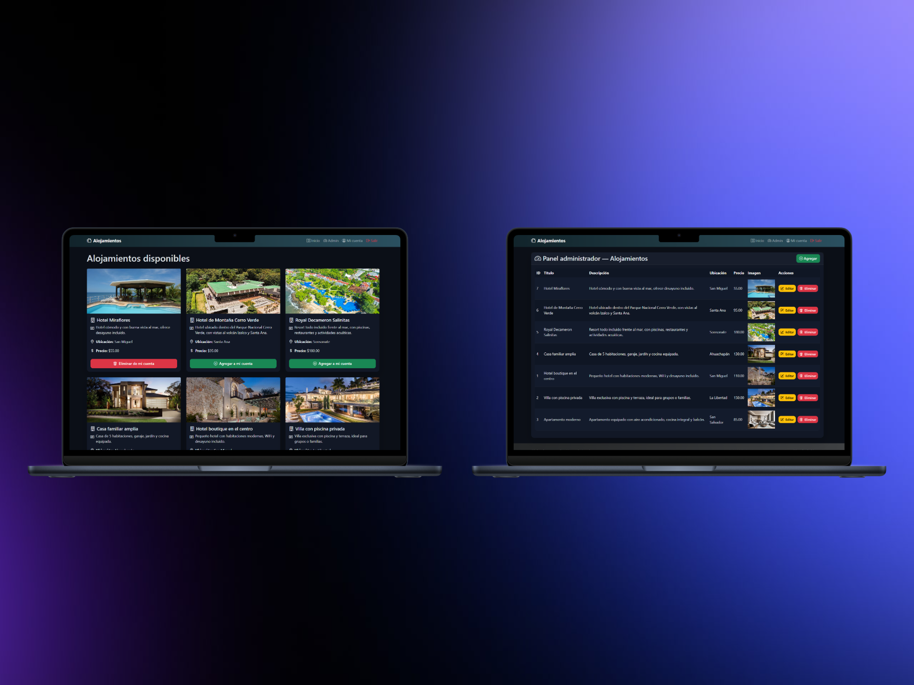
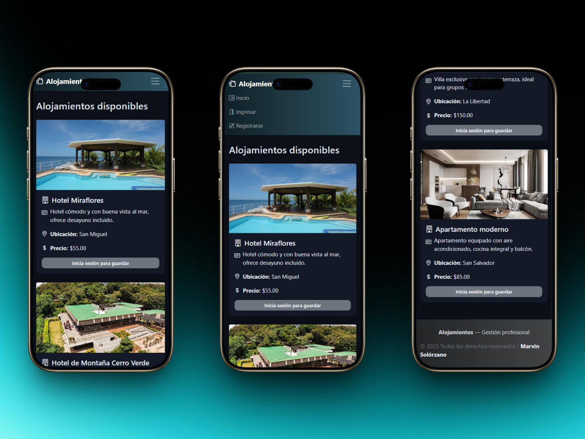
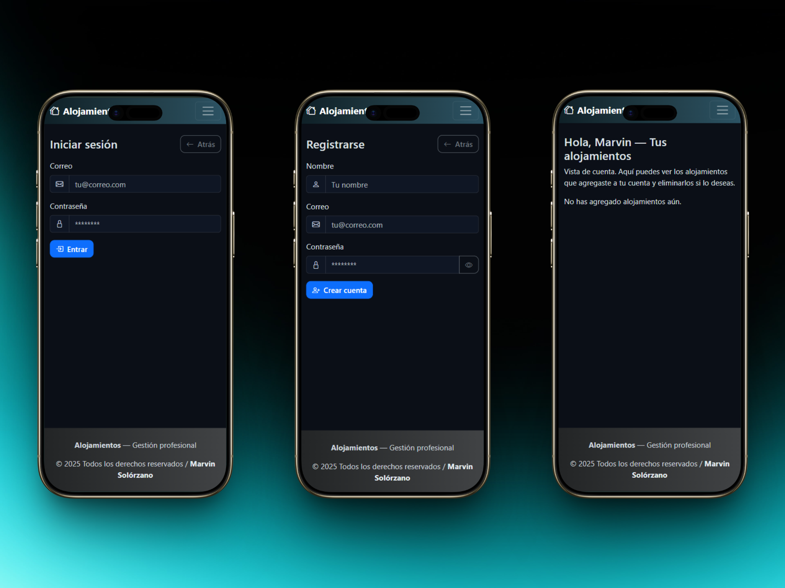
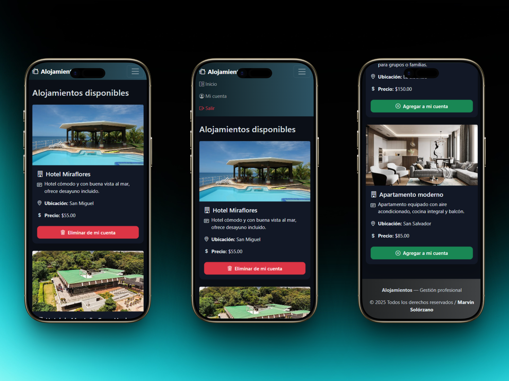
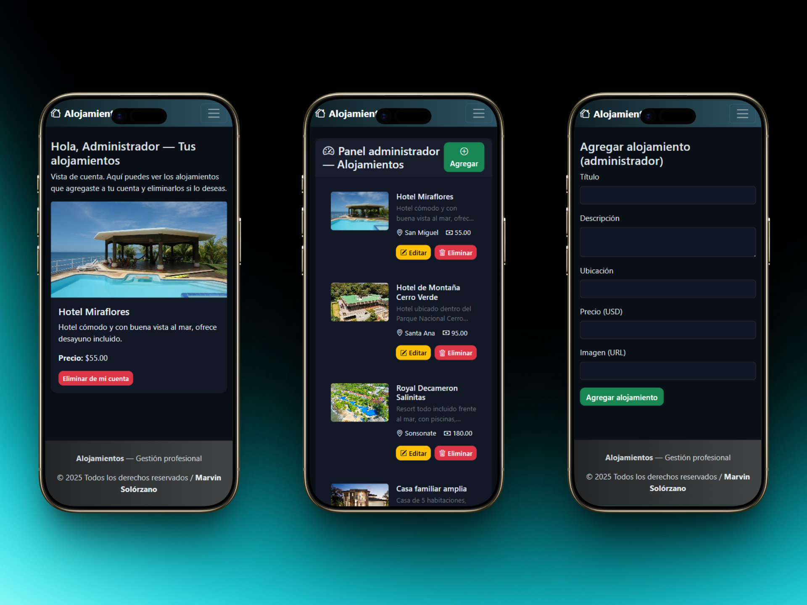

Proyecto CRUD de Alojamientos: Gestión de Usuarios y Administrador
--------------------------------

### 🚀 Rutas principales:
- Landing page: http://localhost/Alojamientos/public/index.php

### 📸 Capturas del proyecto:

### 💻 PC:

  
  
  

### 📲 Celular:

  
  
  
  

